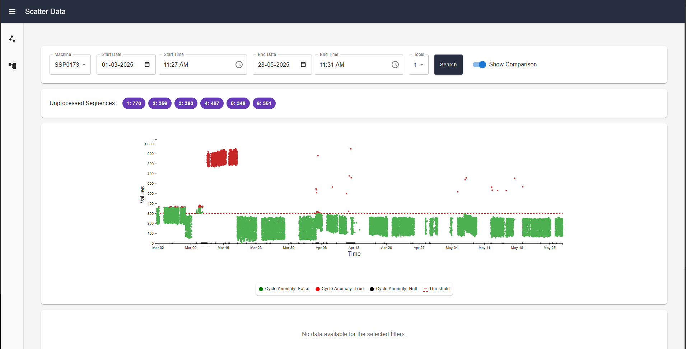
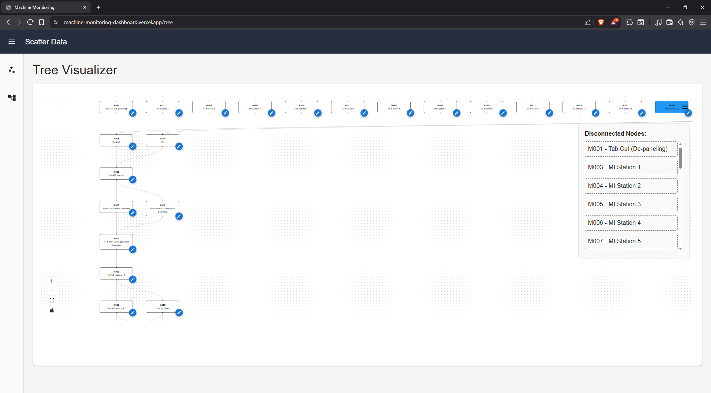
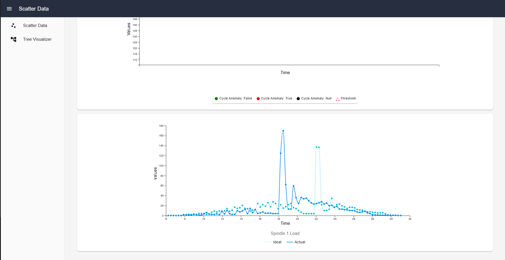

# Machine Monitoring Dashboard

A React-based web application for visualizing and analyzing machine cycle data through interactive scatter plots and time series graphs. This dashboard allows users to filter data, identify anomalies, and compare actual machine signals against an ideal performance signal.

---

## 📁 Project Structure

```plaintext
public/
├── ScatterDataJSON/
│   ├── SSP0167/
│   │   ├── changelog.json
│   │   ├── prediction_data.json
│   │   ├── timeseries_cycledata_black.json
│   │   ├── timeseries_cycledata_green.json
│   │   └── timeseries_cycledata_red.json
│   └── SSP0173/
│       ├── changelog.json
│       ├── prediction_data.json
│       ├── timeseries_cycledata_black.json
│       ├── timeseries_cycledata_green.json
│       └── timeseries_cycledata_red.json
└── treeDataJSON/
    └── graphViz.json

src/
├── assets/
├── Components/
│   ├── Common/
│   │   └── Loader.jsx
│   ├── ErrorBoundary/
│   │   ├── ErrorBoundary.jsx
│   │   └── ErrorFallback.jsx
│   ├── Header/
│   │   └── Header.jsx
│   ├── Layout/
│   │   └── Layout.jsx
│   ├── ScatterLegend/
│   │   └── ScatterLegend.jsx
│   ├── ScatterPlot/
│   │   └── ScatterChart.jsx
│   ├── SideBar/
│   │   └── SideBar.jsx
│   ├── TimeSeriesGraph/
│   │   └── TimeSeriesGraph.jsx
│   ├── TimeSeriesLegend/
│   │   └── TimeSeriesLegend.jsx
│   └── TreeVisualizationComponent/
│       └── TreeVisualization.jsx
├── Pages/
│   ├── ScatterPage.jsx
│   └── TreePage.jsx
├── services/
│   ├── fetchMockData.js
│   └── mockApi.js
├── utils/
│   ├── filterDataByTool.js
│   └── getNodeColor.js
├── App.css
├── App.jsx
├── index.css
└── main.jsx

.gitignore
eslint.config.js
index.html
package-lock.json
```

---

## 🚀 Features

- **Interactive scatter plot visualization with anomaly detection**  
  Visualizes cycle or process data on a scatter plot, clearly distinguishing anomalous data points using color coding. Users can interact with points to drill down for more detail.

- **Tree diagram visualization of process flows**  
  Displays a hierarchical tree diagram showing the flow of machines. Nodes represent machines, helping to visualize system connections intuitively.

- **Time series graphs for detailed cycle data**  
  Allows the user to explore time-based signal data for individual machine cycles. Users can view these graphs for deeper insights into machine performance or anomalies over time.

- **Dynamic filtering of tools, time ranges, and machine states**  
  Supports dynamic filters so users can focus on specific tools, date ranges, or machine conditions. Filtering updates the visualization in real time without requiring a page reload.

- **Modular, reusable React components**  
  Built using a clean, maintainable component structure with separation of concerns, improving testability and scalability.

- **Error boundaries for graceful error handling**  
  Uses React error boundary patterns to catch and handle rendering errors. Displays fallback UI instead of breaking the entire application, enhancing robustness and user trust.

- **Responsive layout with sidebar navigation**  
  Features a responsive design that adapts to various devices, with a sidebar navigation pattern for easy access to filters and page-level navigation.

- **Uses mock JSON data for demonstration**  
  Ships with sample JSON datasets located in the `public` folder to simulate realistic data flows. This supports offline testing and easier demonstrations without a live backend.

- **Easy integration with real APIs**  
  Designed with a service layer that makes it simple to replace mock data with live API calls, enabling fast migration from development to production environments.

---

## ⚙️ Installation

1. **Clone the repository:**

```bash
git clone <repo-url>
cd <repo-folder>
```

2. **Install dependencies:**

```bash
npm install
```

or with yarn:

```bash
yarn
```

3. **Run the development server:**

```bash
npm run dev
```

By default, Vite will serve on [http://localhost:5173](http://localhost:5173).

---

## 🧩 Approach

- Used static mock data that mimics a real API response, to allow realistic testing without requiring a live backend. This also supports easy future integration with production APIs.
- Organized the project around **page-level components**, which act as the main data orchestrators. This reduces the need for additional state management libraries (like Redux or Context) since prop drilling is minimal.
- Applied a **separation of concerns** structure by breaking down reusable UI elements into their own components, supported by utility classes and helpers for cleaner and more maintainable code.
- Chose **Vite** as the build tool for its fast hot module replacement and optimized build performance, enabling rapid development and a smoother developer experience.
- Implemented **error boundaries** to catch exceptions gracefully and prevent a total app crash, displaying a fallback UI instead.
- Designed the user interface for clarity, easy navigation, and efficient data exploration through a sidebar layout and clean visual hierarchy.

---

## 🛠️ Tech Stack

- React
- React DOM
- Vite
- React Router DOM
- @mui/material (Material UI)
- @mui/icons-material
- @mui/x-date-pickers
- @emotion/react
- @emotion/styled
- @xyflow/react (for ReactFlow diagrams)
- notistack (for notifications/snackbars)
- axios (for API requests)
- d3 (for data visualization)
- date-fns (for date utilities)

---

## 🐞 Known Issues / Limitations

- Currently, the graphs have limited responsiveness on smaller tablet screens; scrollbars may appear instead of fully adapting to the screen size.
- The project uses static mock JSON data for demonstration purposes; live API integration will need to be configured separately.
- TypeScript is not yet implemented, so there is no static type safety for props or data shapes.
- Unit tests and integration tests have not yet been added.
- No offline data persistence mechanisms are implemented at this stage.

---

## 📋 Usage / How It Works

- **On Initial Load**  
  The application displays a set of filters, allowing the user to select a machine, start date, end date, and tool sequence. A search button triggers data fetching, while an additional “Show Comparison” button provides an ideal-versus-actual signal toggle.

- **How to Filter**  
  Users can filter data by selecting any date between March 1, 2025, and May 28, 2025. Time values within the day can be set arbitrarily. Filtering by tool sequence further refines the dataset shown in the scatter plot.

- **How to Drill Down into Data**  
  After fetching data with the selected filters, clicking on a data point within the scatter plot will display the actual versus ideal signal for that cycle. If time series data for the selected cycle is not available, the app will display a message indicating “No data present for selected filters.”

- **How to Switch Between Pages**  
  The application uses a sidebar for navigation. You can switch between the scatter plot page and the tree visualization page from this sidebar.

- **Tree Visualization Page**  
  On initial load, the tree visualization page renders a canvas with a ReactFlow-based diagram representing the machine process structure. The user can edit machine nodes, add new ones, or change their category through the provided options.

---

## 📸 Screenshots

### 🟢 Scatter Plot Page



### 🟢 Tree Visualization Page



### 🟢 Time Series Graph



---

## 📈 Future Improvements

- Enhance responsiveness of graphs for better support on tablets and smaller devices
- Migrate the codebase to TypeScript for type safety
- Add unit and integration tests
- Integrate with a real-time live API
- Implement data persistence or caching strategies

---
